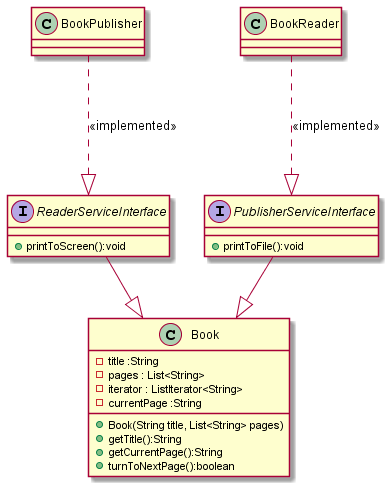

## BEFORE


## AFTER



```
พบว่า Reader กับ Publisher นั้นใช้งาน Book ร่วมกันอยู่ 
หากต้องการจะแก้ไขให้ตรง design principle ที่ง่ายที่สุดจะเลือกใช้ SRP 
ซึ่งตามตามแนวคิดจะกล่าวไว้ว่า ในหนึ่ง module ควรจะรับผิดชอบโดย 1 Actor ,

และอีกวิธีหนึ่งก็คือ Interface Segregation principle (ISP) 
คือการแตก Interface ที่มี medtod ที่ปนกันของ < 2 actors ออกมาและให้ตัว class implement เฉพาะขอบเขตหน้าที่ของตัวเอง

```


